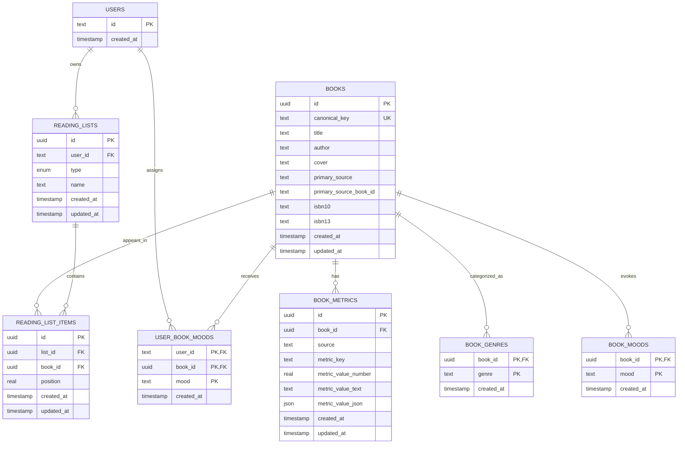

# Database Schema

Notes:

- `books` stores canonical metadata shared across users and lists.
- `book_metrics` is reserved for source-derived ratings, mood scores, and other external signals.
- `reading_list_items` keeps the ordered list state per user list, while `books` stays reusable.
